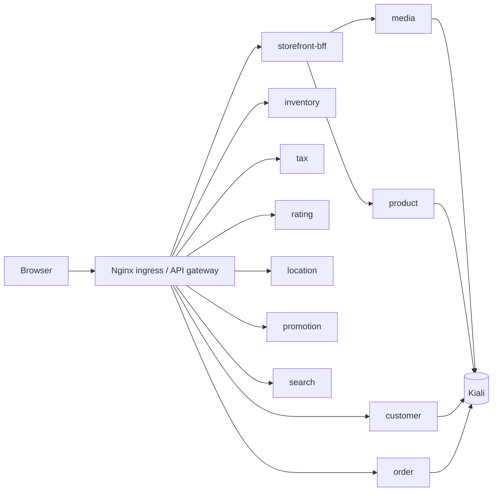

# Yas Dev Service Mesh

Runbook Istio cho namespace `yas-dev`.

## Mục tiêu
- Bật mTLS toàn namespace `yas-dev`
- Giới hạn service-to-service bằng `AuthorizationPolicy`
- Bật retry/timeout cho route đi tới `media`
- Quan sát topology bằng Kiali

## Bài test 3 service
- Service được phép gọi: `storefront-bff`
- Service được bảo vệ: `media` và `product`
- Service debug để test deny: `mesh-debug`

Mục tiêu của bài test là cho thấy chỉ `storefront-bff` mới được phép gọi vào `media`/`product`, còn pod khác trong `yas-dev` sẽ bị chặn.

## Topology mục tiêu


## Kịch bản triển khai
1. Cài Istio control plane và Kiali trong cluster.
2. Bật sidecar injection cho namespace `yas-dev`.
3. Apply `PeerAuthentication` với `STRICT` để bật mTLS.
4. Apply `DestinationRule` với `ISTIO_MUTUAL` cho traffic trong mesh.
5. Apply `AuthorizationPolicy` allow-list cho từng service cần bảo vệ.
6. Apply `VirtualService` retry/timeout cho route cần resilience.
7. Kiểm tra topology trong Kiali rồi chụp screenshot.
8. Chạy test allow/deny bằng `curl` từ pod trong `yas-dev`.

## Apply manifests
```bash
kubectl label namespace yas-dev istio-injection=enabled --overwrite

kubectl apply -f environments/dev/service_mesh/istio/ServiceAccount.yaml
kubectl apply -f environments/dev/service_mesh/istio/mtls-peer-auth.yaml
kubectl apply -f environments/dev/service_mesh/istio/destination-rules.yaml
kubectl apply -f environments/dev/service_mesh/istio/auth-policy.yaml
kubectl apply -f environments/dev/service_mesh/istio/retry-policy.yaml
```

## Kiali
- Mở Kiali và chọn namespace `yas-dev`.
- Xác nhận các pod đã có sidecar Envoy.
- Quan sát các edge giữa `storefront-bff -> media/product` và các service khác trong namespace.
- Dùng topology này làm ảnh minh chứng cho bài thực hành.

## Ghi chú file
- `istio/mtls-peer-auth.yaml`: mTLS namespace-wide
- `istio/destination-rules.yaml`: TLS nội bộ mesh
- `istio/auth-policy.yaml`: allow-list theo service account
- `istio/retry-policy.yaml`: retry/timeout cho `media`
- `istio/namespace-label.md`: lệnh bật sidecar injection

## Lưu ý
- Tất cả manifest đều scope vào `yas-dev`.
- Muốn test deny thì dùng một pod với service account không nằm trong allow-list.
- Muốn Kiali hiện topology đúng, các workload phải được inject sidecar trước khi chạy test.
