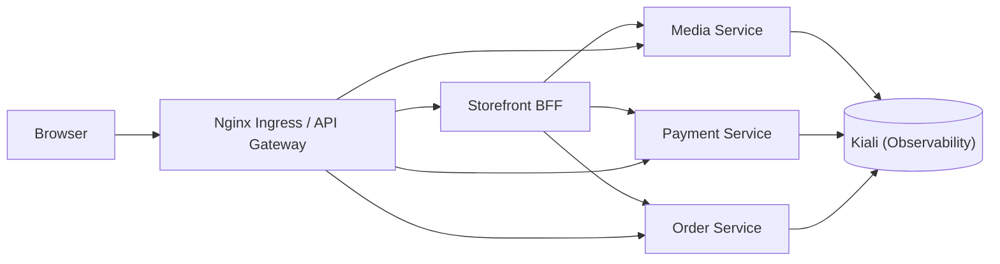

# Yas Dev Service Mesh

Runbook Istio cho namespace `yas-dev`.

## Mục tiêu
- Bật mTLS toàn namespace `yas-dev`
- Giới hạn service-to-service bằng `AuthorizationPolicy`
- Bật retry/timeout cho route đi tới `media`
- Quan sát topology bằng Kiali

## Bài test 3 service
- Service được phép gọi: `storefront-bff`, `nginx`
- Service được bảo vệ: `media`, `payment`, `order`
- Service debug để test deny: `mesh-debug`

Mục tiêu của bài test là cho thấy chỉ `storefront-bff` và `nginx` mới được phép gọi vào `media`/`payment`/`order`, còn pod khác trong `yas-dev` sẽ bị chặn.
Để Kiali hiển thị đường màu xanh, cần tạo traffic hợp lệ trả về `200` từ một path thật sự tồn tại, ví dụ `/<service>/v3/api-docs`.

## Topology mục tiêu


## Kịch bản triển khai
1. Cài Istio control plane và Kiali trong cluster.
2. Bật sidecar injection cho namespace `yas-dev`.
3. Apply `PeerAuthentication` với `STRICT` để bật mTLS.
4. Apply `DestinationRule` với `ISTIO_MUTUAL` cho traffic trong mesh.
5. Apply `AuthorizationPolicy` allow-list cho `media`, `payment`, `order`.
6. Apply `VirtualService` retry/timeout cho route cần resilience.
7. Kiểm tra topology trong Kiali rồi chụp screenshot.
8. Chạy test allow/deny bằng `curl` từ pod trong `yas-dev`.

## Deliverables
- YAML cấu hình mesh: [mtls-peer-auth.yaml](mtls-peer-auth.yaml), [destination-rules.yaml](destination-rules.yaml), [auth-policy.yaml](auth-policy.yaml), [retry-policy.yaml](retry-policy.yaml), [ServiceAccount.yaml](ServiceAccount.yaml).
- Ảnh Kiali topology kèm mô tả ngắn về luồng `storefront-bff/nginx -> media/payment/order`.
- Test plan và logs minh chứng: [test_plan.sh](test_plan.sh) với kết quả `200`, `403`, `500` và retry evidence.
- Hướng dẫn triển khai nhanh: làm theo các bước trong file này hoặc chạy [test-plan.md](test-plan.md) để xem bản rút gọn.

## Apply manifests
```bash
kubectl label namespace yas-dev istio-injection=enabled --overwrite

kubectl apply -f environments/dev/service_mesh/istio/ServiceAccount.yaml
kubectl apply -f environments/dev/service_mesh/istio/mtls-peer-auth.yaml
kubectl apply -f environments/dev/service_mesh/istio/destination-rules.yaml
kubectl apply -f environments/dev/service_mesh/istio/auth-policy.yaml
kubectl apply -f environments/dev/service_mesh/istio/retry-policy.yaml
```

Lưu ý: block trên là lệnh nhanh one-shot. Nếu muốn triển khai và kiểm thử tuần tự, dùng phần `Kịch bản chạy từ từ` bên dưới.

## Kịch bản chạy từ từ
Nếu bạn muốn chạy tự động theo kịch bản đã chốt, dùng script này:
```bash
bash environments/dev/service_mesh/test_plan.sh
```

### Bước 1: Pre-check
```bash
kubectl get ns istio-system
kubectl get ns yas-dev --show-labels
kubectl get pods -n yas-dev -o wide
```

### Bước 2: Apply policy
```bash
kubectl apply -f environments/dev/service_mesh/istio/ServiceAccount.yaml
kubectl apply -f environments/dev/service_mesh/istio/mtls-peer-auth.yaml
kubectl apply -f environments/dev/service_mesh/istio/destination-rules.yaml
kubectl apply -f environments/dev/service_mesh/istio/auth-policy.yaml
kubectl apply -f environments/dev/service_mesh/istio/retry-policy.yaml
```

### Bước 3: Restart workload để nhận sidecar/policy mới
```bash
kubectl rollout restart deploy/storefront-bff -n yas-dev
kubectl rollout restart deploy/nginx -n yas-dev
kubectl rollout restart deploy/media -n yas-dev
kubectl rollout restart deploy/payment -n yas-dev
kubectl rollout restart deploy/order -n yas-dev
kubectl rollout status deploy/storefront-bff -n yas-dev --timeout=120s
kubectl rollout status deploy/nginx -n yas-dev --timeout=120s
kubectl rollout status deploy/media -n yas-dev --timeout=120s
kubectl rollout status deploy/payment -n yas-dev --timeout=120s
kubectl rollout status deploy/order -n yas-dev --timeout=120s
```

### Bước 4: Test allow
```bash
kubectl exec -n yas-dev deploy/storefront-bff -- curl -sv http://media.yas-dev.svc.cluster.local/
kubectl exec -n yas-dev deploy/storefront-bff -- curl -sv http://payment.yas-dev.svc.cluster.local/
kubectl exec -n yas-dev deploy/storefront-bff -- curl -sv http://order.yas-dev.svc.cluster.local/

kubectl exec -n yas-dev deploy/nginx -- curl -sv http://media.yas-dev.svc.cluster.local/
kubectl exec -n yas-dev deploy/nginx -- curl -sv http://payment.yas-dev.svc.cluster.local/
kubectl exec -n yas-dev deploy/nginx -- curl -sv http://order.yas-dev.svc.cluster.local/
```

### Bước 5: Test deny
```bash
kubectl apply -n yas-dev -f - <<'EOF'
apiVersion: v1
kind: Pod
metadata:
  name: mesh-debug
spec:
  serviceAccountName: mesh-debug
  containers:
    - name: curl
      image: curlimages/curl:8.10.1
      command: ["sh", "-c", "sleep 3600"]
EOF

kubectl exec -n yas-dev mesh-debug -- curl -sv http://media.yas-dev.svc.cluster.local/
kubectl exec -n yas-dev mesh-debug -- curl -sv http://payment.yas-dev.svc.cluster.local/
kubectl exec -n yas-dev mesh-debug -- curl -sv http://order.yas-dev.svc.cluster.local/
```

Kỳ vọng:
- caller `storefront-bff` và `nginx` được phép truy cập 3 service đích
- caller `mesh-debug` bị từ chối bởi AuthorizationPolicy (thường 403 hoặc RBAC denied)
- do `VirtualService` retry chỉ gắn cho `media`, case retry evidence tập trung vào `media`

## Lưu ý
- Tất cả manifest đều scope vào `yas-dev`.
- Muốn test deny thì dùng một pod với service account không nằm trong allow-list.
- Muốn Kiali hiện topology đúng, các workload phải được inject sidecar trước khi chạy test.
