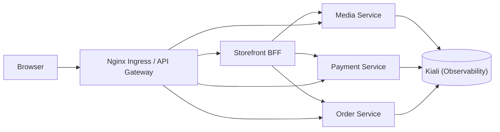

# Yas Dev Service Mesh

Runbook Istio cho namespace `yas-dev`.

## Mục tiêu
- Bật mTLS toàn namespace `yas-dev`
- Giới hạn service-to-service bằng `AuthorizationPolicy`
- Bật retry/timeout cho route đi tới `media`
- Quan sát topology bằng Kiali

## Bài test 3 service
- Service được phép gọi: `storefront-bff`, `nginx`
- Service được bảo vệ: `media`, `payment`, `order`
- Service debug để test deny: `mesh-debug`

Mục tiêu của bài test là cho thấy chỉ `storefront-bff` và `nginx` mới được phép gọi vào `media`/`payment`/`order`, còn pod khác trong `yas-dev` sẽ bị chặn.
Để Kiali hiển thị đường màu xanh, cần tạo traffic hợp lệ trả về `200` từ một path thật sự tồn tại, ví dụ `/<service>/v3/api-docs`.

## Topology mục tiêu


## Kịch bản triển khai
1. Cài Istio control plane và Kiali trong cluster.
2. Bật sidecar injection cho namespace `yas-dev`.
3. Apply `PeerAuthentication` với `STRICT` để bật mTLS.
4. Apply `DestinationRule` với `ISTIO_MUTUAL` cho traffic trong mesh.
5. Apply `AuthorizationPolicy` allow-list cho `media`, `payment`, `order`.
6. Apply `VirtualService` retry/timeout cho route cần resilience.
7. Kiểm tra topology trong Kiali rồi chụp screenshot.
8. Chạy test allow/deny bằng `curl` từ pod trong `yas-dev`.

## Deliverables
- YAML cấu hình mesh: [mtls-peer-auth.yaml](mtls-peer-auth.yaml), [destination-rules.yaml](destination-rules.yaml), [auth-policy.yaml](auth-policy.yaml), [retry-policy.yaml](retry-policy.yaml), [ServiceAccount.yaml](ServiceAccount.yaml).
- Ảnh Kiali topology kèm mô tả ngắn về luồng `storefront-bff/nginx -> media/payment/order`.
- Test plan và logs minh chứng: [test_plan.sh](test_plan.sh) với kết quả `200`, `403`, `500` và retry evidence.
- Hướng dẫn triển khai nhanh: dùng luôn phần “Kịch bản chạy từ từ” và “Kịch bản kiểm thử ngắn” bên dưới.

## Apply manifests
```bash
kubectl label namespace yas-dev istio-injection=enabled --overwrite

kubectl apply -f environments/dev/service_mesh/ServiceAccount.yaml
kubectl apply -f environments/dev/service_mesh/mtls-peer-auth.yaml
kubectl apply -f environments/dev/service_mesh/destination-rules.yaml
kubectl apply -f environments/dev/service_mesh/auth-policy.yaml
kubectl apply -f environments/dev/service_mesh/retry-policy.yaml
```

Lưu ý: đây là 5 file YAML phải apply xong trước khi chạy `test_plan.sh`.

## Trình tự bắt buộc
### Bước 1: Apply đủ 5 file YAML
```bash
kubectl apply -f environments/dev/service_mesh/ServiceAccount.yaml
kubectl apply -f environments/dev/service_mesh/mtls-peer-auth.yaml
kubectl apply -f environments/dev/service_mesh/destination-rules.yaml
kubectl apply -f environments/dev/service_mesh/auth-policy.yaml
kubectl apply -f environments/dev/service_mesh/retry-policy.yaml
```

### Bước 2: Kiểm tra nhanh namespace và pod
```bash
kubectl get ns istio-system
kubectl get ns yas-dev --show-labels
```

### Bước 3: Restart workload nếu vừa apply xong policy mới 
```bash
kubectl rollout restart deploy/storefront-bff -n yas-dev
kubectl rollout restart deploy/nginx -n yas-dev
kubectl rollout restart deploy/media -n yas-dev
kubectl rollout restart deploy/payment -n yas-dev
kubectl rollout restart deploy/order -n yas-dev
kubectl rollout status deploy/storefront-bff -n yas-dev --timeout=120s
kubectl rollout status deploy/nginx -n yas-dev --timeout=120s
kubectl rollout status deploy/media -n yas-dev --timeout=120s
kubectl rollout status deploy/payment -n yas-dev --timeout=120s
kubectl rollout status deploy/order -n yas-dev --timeout=120s
```

Các câu lệnh trên là chỉ restart những pods cho kịch bản test, không cần restart hết
Hoặc có thể sử dụng câu lệnh để inject sidecar hết cho các pods
```bash
# Restart tất cả pods để inject Envoy sidecar
kubectl rollout restart deployment -n yas-dev

# Verify: cột READY phải là 2/2 (app + sidecar)
kubectl get pods -n yas-dev
```

### Bước 4: Chạy test_plan.sh để thu kết quả tổng hợp
```bash
bash environments/dev/service_mesh/test_plan.sh
```

Kỳ vọng:
- `200` khi caller hợp lệ gọi đúng path.
- `403` khi caller không nằm trong allow-list.
- `500` kèm nhiều dòng `REQUEST /` trong logs khi retry được kích hoạt.

## Lưu ý
- Tất cả manifest đều scope vào `yas-dev`.
- Muốn test deny thì dùng một pod với service account không nằm trong allow-list.
- Muốn Kiali hiện topology đúng, các workload phải được inject sidecar trước khi chạy test.
- Nếu cluster dùng revision-based injection thì đổi label cho đúng revision thay vì `istio-injection=enabled`.
